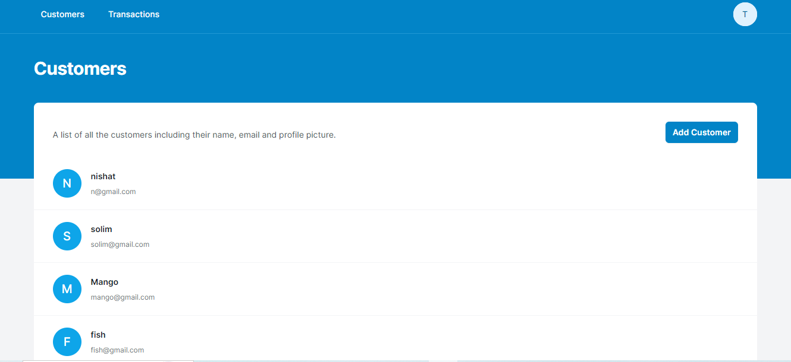
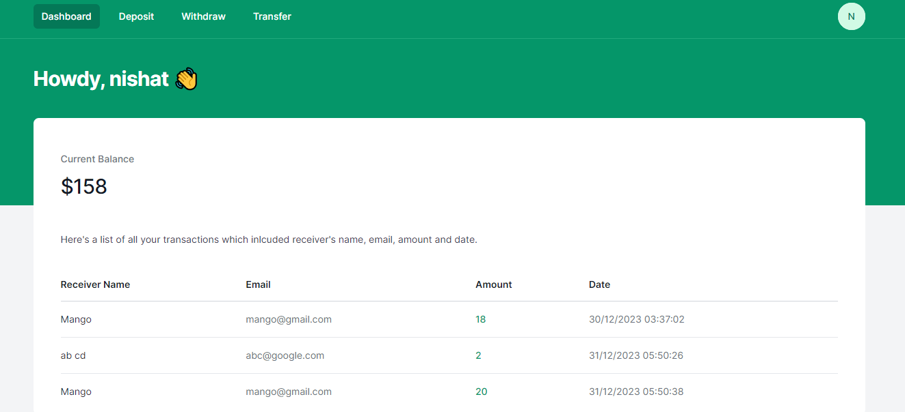

# Simple Banking Web Application

This is a simple banking application with features for both 'Admin' and 'Customer' users.

### UI Creadit

UI Code:

```bash
https://github.com/alnahian2003/bangubank.git
```





## Admin Features

- See all transactions made by all users.
- Search and view transactions by a specific user using their email.
- View a list of all registered customers.

## Customer Features

- Customers can register using their `name`, `email`, and `password`.
- Customers can log in using their registered email and password.
- See a list of all their transactions.
- Deposit money to their account.
- Withdraw money from their account.
- Transfer money to another customer's account by specifying their email address.
- See the current balance of their account.

### To Start

Customer Section:

```bash
php index.php
```

Admin Section:

```bash
php Admin.php
```
